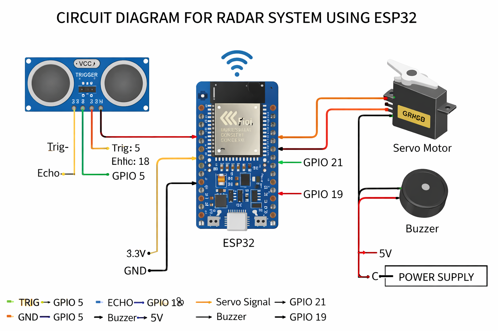
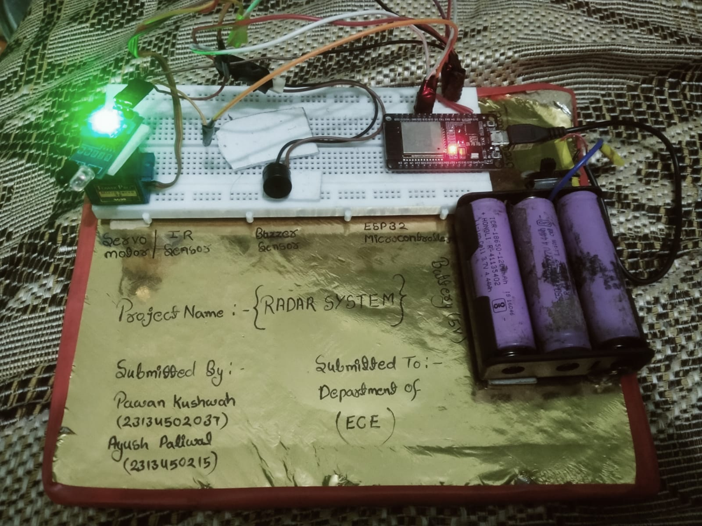
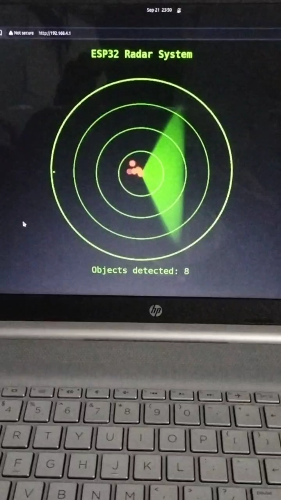

# 📡 ESP32 Radar Detection System
 An IoT-based real-time radar system using ESP32 for object detection and visualization.

## 🔹 Overview
This project is an advanced radar detection system using ESP32, IR/ultrasonic sensor (HC-SR04), and a servo motor. It performs real-time 180° area scanning and visualizes detected objects on a web-based radar interface.

## 🔹 Features
- 180° area scanning using servo motor  
- Real-time distance measurement using ultrasonic sensor  
- Web-based radar visualization (live data)  
- Buzzer alert on object detection  
- Wireless monitoring via ESP32 WiFi  

## 🔹 Components
- ESP32  
- IR/Ultrasonic Sensor (HC-SR04)  
- Servo Motor  
- Buzzer  
- Power Supply
   
## 🛠️ Technologies Used
- ESP32 (WiFi-enabled microcontroller)
- IR/Ultrasonic Sensor (HC-SR04)
- Servo Motor
- Embedded C (Arduino IDE)
- Web Interface (HTML, CSS, JavaScript)

  
## 🔹 Circuit Connections
- TRIG → GPIO 5  
- ECHO → GPIO 18  
- Servo Signal → GPIO 21  
- Buzzer → GPIO 19  
- VCC → 5V / 3.3V  
- GND → GND  

## 🔹 Working Principle
The servo motor rotates from 0° to 180° and scans the surroundings. The IR/ultrasonic sensor measures the distance of objects in its path. This data is sent to a web interface via ESP32 WiFi, where a radar-like display is generated in real time. If an object is detected within a certain range, a buzzer alert is triggered.

## 🎯 Key Learning
- Sensor interfacing with ESP32
- PWM control for servo motor
- Real-time data processing
- Web-based IoT visualization

## ⚠️ Safety Note
Ensure proper voltage levels for ESP32 (3.3V logic). Avoid directly connecting 5V signals to GPIO pins.

## 🔌 Circuit Diagram

## 📷 Project Model

## 📊 Radar Visualization (Live Output)
The system generates a real-time radar display using ESP32's web interface.  
Detected objects are visualized as points based on angle and distance.

## 💻 Code
The code is available in: `radar_system.ino`

⚠️ Note:
The code provided in this repository is the actual working implementation of the project.
The code included in the project report is a simplified/earlier version and may not fully represent the final working system.

## 🌐 How to Use
1. Upload the code to ESP32 using Arduino IDE  
2. Connect to WiFi network: ESP32-Radar  
3. Open browser and go to: [http://192.168.4.1](http://192.168.4.1)  
4. View real-time radar scanning interface

## 📄 Project Report
[Download PDF](project_report.pdf)

## 🎥 Demo
[▶️ Watch Demo Video](https://www.linkedin.com/posts/kushwahapawan527_radarsystem-esp32-iotprojects-ugcPost-7402982430950723584-iHJr?utm_source=share&utm_medium=member_desktop&rcm=ACoAAFDvl2kB6PRtyj4xUWG4RrN098KB23CkRwY)

## 🚀 Future Improvements
- Mobile app integration  
- Cloud-based data logging  
- AI-based object classification  
- Longer range detection system  
